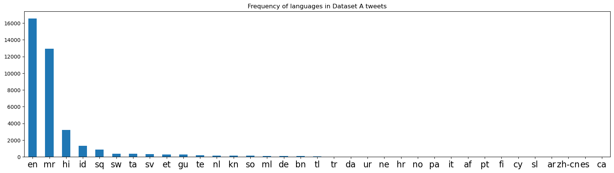
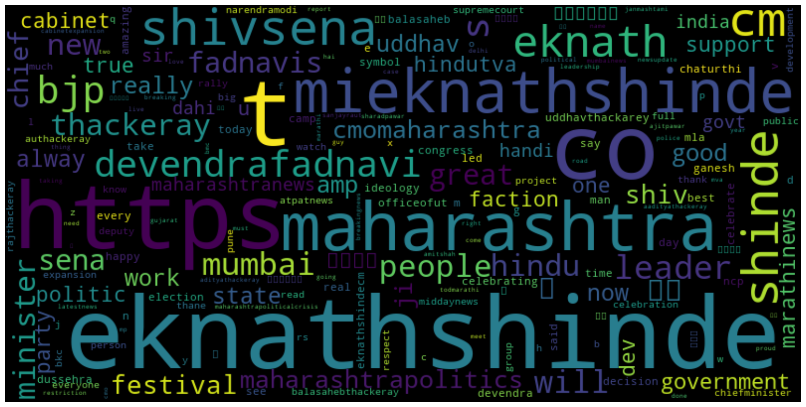
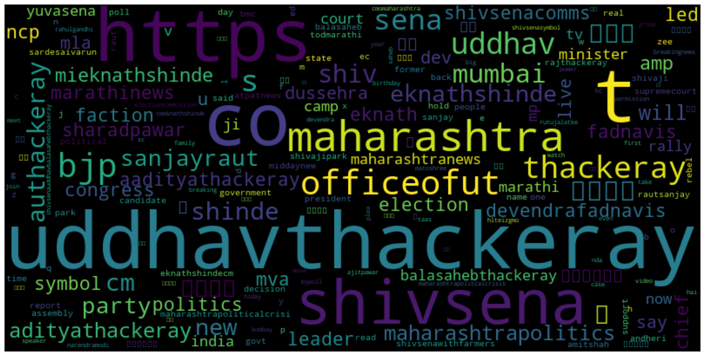
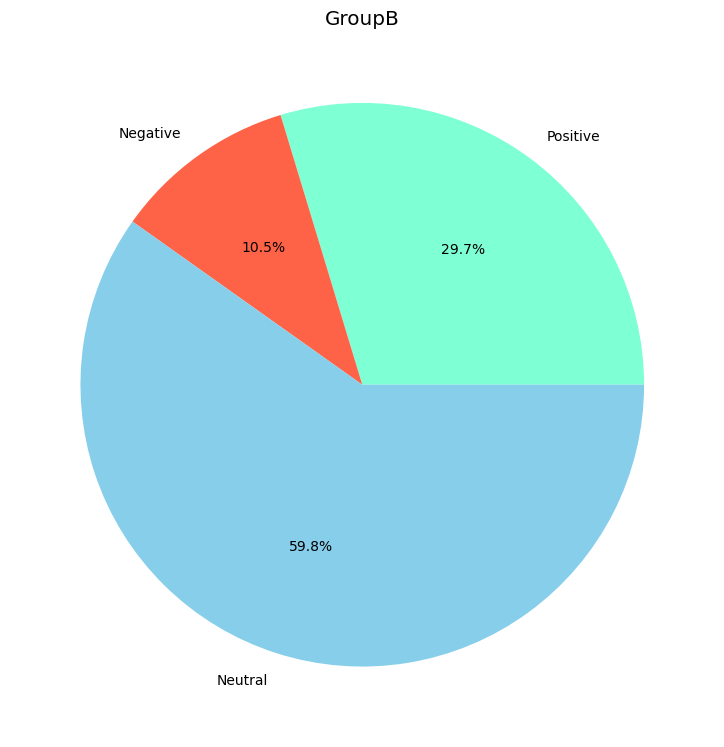
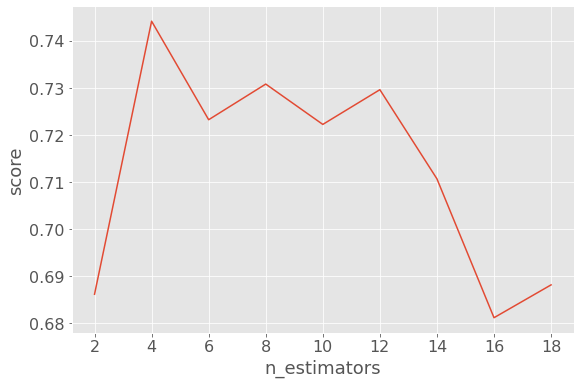

# Contender Popularity Analysis — Twitter Sentiment, VADER & Machine Learning

> Predicting the more popular of two political contenders by mining ~100,000 tweets, scoring sentiment with **VADER**, classifying opinion with **8 ML models**, and distilling everything into a single interpretable **Popularity Score**.


---

## Table of Contents

- [Overview](#overview)
- [The Contenders](#the-contenders)
- [Repository Structure](#repository-structure)
- [The Pipeline](#the-pipeline)
- [Data Collection & Description](#data-collection--description)
- [Text Preprocessing](#text-preprocessing)
- [Exploratory Visualisation](#exploratory-visualisation)
- [Sentiment Analysis (VADER)](#sentiment-analysis-vader)
- [Feature Engineering](#feature-engineering)
- [Model Results](#model-results)
- [The Popularity Score](#the-popularity-score)
- [Key Findings](#key-findings)
- [Getting Started](#getting-started)
- [Limitations](#limitations)
- [Future Scope](#future-scope)
- [References & Resources](#references--resources)
- [Author & License](#author--license)

---

## Overview

This project explores whether **public Twitter sentiment can act as a proxy for political popularity**. It focuses on two prominent Maharashtra politicians during the run-up to the Brihanmumbai Municipal Corporation (BMC) election, collecting tens of thousands of tweets about each, and turning raw, noisy text into a comparable measure of public standing.

The workflow combines three complementary ideas:

1. **Lexicon-based sentiment** — VADER assigns every tweet a positive / neutral / negative label using a rule-based model tuned for social-media language.
2. **Supervised learning** — eight machine-learning classifiers (across two vectorisation schemes) are trained on the VADER-labelled data and used to cross-check sentiment on a second, unseen contender.
3. **The Popularity Score** — a single custom metric that condenses the sentiment mix of thousands of tweets into one number per contender, making the two directly comparable.

## The Contenders

| | Contender | Party context (2022) |
|---|---|---|
| **A** | **Eknath Shinde** | Led the faction that split from the undivided Shiv Sena and became Chief Minister of Maharashtra in June 2022 |
| **B** | **Uddhav Thackeray** | Former Chief Minister; led the rival Shiv Sena (UBT) faction |

The data-collection window (**June–November 2022**) coincides with the Maharashtra political crisis and the resulting Shiv Sena split, which is exactly the period this analysis captures. The goal is to compare the *public sentiment footprint* of each contender rather than to certify the result of any single ballot.

## Repository Structure

```
Contender-Popularity-Analysis-ML-VADER/
├── Code.ipynb           # End-to-end notebook: scrape → clean → VADER → ML → Popularity Score
├── Raw_Tweets.zip       # Source datasets: Eknath_RawTweets.csv & Uddhav_RawTweets.csv (~100k tweets)
├── Presentation.pdf     # Slide deck — methodology, visuals and findings
├── requirements.txt     # Python dependencies
├── assets/              # Figures rendered from the notebook (used in this README)
├── LICENSE              # MIT
└── README.md            # You are here
```

## The Pipeline

```
Tweets (snscrape)
      │
      ▼
De-duplication ──► Language detection (langdetect) ──► keep English only
      │
      ▼
Text cleaning ──► stop-word removal ──► stemming & lemmatisation ──► tokenisation
      │
      ├───────────────► VADER sentiment  ──►  Positive / Neutral / Negative labels
      │                                                 │
      ▼                                                 ▼
Vectorisation (TF-IDF & Word2Vec)              Popularity Score (per contender)
      │
      ▼
8 classifiers × 2 vectorisers  ──►  ensembles (Bagging / Boosting / XGBoost)
      │
      ▼
Best model (SVM + TF-IDF) applied to the second contender for cross-validation
```

## Data Collection & Description

Tweets were collected with **snscrape** between **30 June 2022 and 15 November 2022** — roughly **50,000 tweets per contender**. Each record contains:

| Field | Description |
|---|---|
| `Like_Count` | Number of likes on the tweet |
| `Retweet_Count` | Number of retweets |
| `Username` | Handle of the posting account |
| `Date` | Timestamp of the tweet |
| `Tweet` | Raw tweet text |

> **⚠️ The collection cells no longer run.** `snscrape` relied on undocumented Twitter endpoints that were shut down after X/Twitter's 2023 API changes, so the scraping stage cannot be reproduced today. The **already-collected datasets are bundled in [`Raw_Tweets.zip`](Raw_Tweets.zip)**, and every downstream cell runs against those files — so the analysis remains fully reproducible from the cleaning stage onward.

## Text Preprocessing

Raw tweets are extremely noisy, so cleaning is a substantial part of the pipeline:

- **Normalisation** — lower-casing, removal of URLs, mentions, punctuation and extra whitespace.
- **Language filtering** — `langdetect` labels each tweet's language; only English (`en`) tweets are kept.
- **Stop-word removal** — high-frequency, low-signal words (`the`, `is`, `and`, …) are dropped.
- **Stemming & lemmatisation** — words are reduced to root forms (e.g. *celebrating → celebr*, *celebrate → celebrate*).

After filtering and de-duplication the working datasets are:

| Contender | Raw tweets | After English filter + de-dup |
|---|---:|---:|
| Eknath Shinde | 50,001 | **16,569** |
| Uddhav Thackeray | 49,114 | **10,878** |

The language breakdown below shows why filtering matters — English dominates, but Marathi (`mr`) and Hindi (`hi`) make up a large, and here excluded, share of the conversation:



## Exploratory Visualisation

Word clouds of the cleaned corpora surface the dominant themes and entities around each contender.

| Eknath Shinde | Uddhav Thackeray |
|:---:|:---:|
|  |  |

## Sentiment Analysis (VADER)

Every cleaned tweet is scored with **VADER** (Valence Aware Dictionary and sEntiment Reasoner), which outputs a compound score used to bucket tweets into **Positive / Neutral / Negative**. VADER is well-suited here because it is built for short, informal, social-media text and handles emphasis, negation and slang out of the box.

Example compound scores: *"A great leader"* → `0.6249`, *"A fine CM!"* → `0.2714`.

The chart below shows the model-predicted sentiment mix for Uddhav Thackeray:



## Feature Engineering

Two vectorisation strategies convert cleaned text into numerical features so that classifiers can learn from it:

- **TF-IDF** — Term Frequency–Inverse Document Frequency, weighting words by how distinctive they are.
- **Word2Vec** — dense embeddings that capture semantic similarity between words (via a mean-embedding vectoriser over each tweet).

## Model Results

Classifiers were trained on **Eknath Shinde's VADER-labelled tweets** (train/validation split) to learn a sentiment classifier, then the **best model was applied to Uddhav Thackeray's tweets** to cross-validate the sentiment labels independently of VADER. Hyper-parameters (e.g. `k` for KNN, `n_estimators` for ensembles) were tuned by sweeping values and selecting the best score:



Validation accuracy by model and vectoriser:

| Model | TF-IDF | Word2Vec |
|---|---:|---:|
| **SVM** | **86.9%** | 71.1% |
| Logistic Regression | 84.1% | 71.3% |
| Random Forest | 79.6% | 73.3% |
| Decision Tree | 77.7% | 65.5% |
| KNN | 76.7% *(k=5)* | 69.9% *(k=13)* |
| Naive Bayes | 73.2% | 61.7% |
| XGBoost | 87.0% *(n=256)* | 72.9% *(n=90)* |
| Bagging (SVM) | 86.9% *(n=128)* | 71.1% *(n=32)* |

**Takeaways**

- **TF-IDF decisively out-performs Word2Vec** on this dataset — every classifier scores higher with TF-IDF features.
- **SVM + TF-IDF** is the standout model at **≈86.9%**, matched only by the more expensive **XGBoost** and **Bagging-SVM** ensembles (~87%).
- SVM + TF-IDF was therefore chosen as the production model for cross-contender prediction.

## The Popularity Score

To reduce a whole contender's sentiment mix to one comparable number, the project defines a **Popularity Score**:

```
Popularity Score = (Positive − Negative) / (Positive + Neutral + Negative) × 100
```

It is simply the **net positive sentiment** expressed as a percentage of all tweets — intuitive, bounded and directly comparable between contenders.

| Contender | Method | Positive | Neutral | Negative | Popularity Score |
|---|---|---:|---:|---:|---:|
| **Eknath Shinde** | VADER | 7,512 | 6,924 | 2,133 | **32.46** |
| Uddhav Thackeray | VADER | 2,632 | 6,636 | 1,610 | **9.40** |
| Uddhav Thackeray | SVM + TF-IDF | 3,229 | 6,508 | 1,141 | **19.19** |

## Key Findings

- **Eknath Shinde carries a substantially higher Popularity Score (32.46)** than Uddhav Thackeray (9.40 by VADER, 19.19 by the ML model) — identifying Shinde as the more positively-received contender in the sampled conversation.
- The result is **consistent across both scoring methods** (rule-based VADER and the supervised SVM model), which strengthens confidence in the signal.
- This aligns with the real-world backdrop of the period, in which Shinde emerged as Chief Minister following the June 2022 Shiv Sena split.
- **Engagement and sentiment together** paint a richer picture than raw tweet volume alone.

## Getting Started

```bash
# 1. Clone the repository
git clone https://github.com/VinayakMokashi/Contender-Popularity-Analysis-ML-VADER.git
cd Contender-Popularity-Analysis-ML-VADER

# 2. (Recommended) create a virtual environment
python -m venv venv
source venv/bin/activate        # Windows: venv\Scripts\activate

# 3. Install dependencies
pip install -r requirements.txt

# 4. Unzip the datasets next to the notebook
unzip Raw_Tweets.zip

# 5. Launch the notebook
jupyter notebook Code.ipynb
```

The notebook also downloads a few NLTK corpora on first run:

```python
import nltk
nltk.download('stopwords')
nltk.download('punkt')
nltk.download('wordnet')
nltk.download('vader_lexicon')
```

> **Note:** run the notebook **starting from the data-loading cells** (the ones that read `Eknath_RawTweets.csv` / `Uddhav_RawTweets.csv`). The earlier `snscrape` scraping cells are kept for transparency but will not return data (see [Data Collection](#data-collection--description)).

## Limitations

- **Not reproducible from scratch** — live scraping is dead; the analysis depends on the bundled snapshot.
- **English-only** — a large volume of Marathi and Hindi tweets (see the language chart) is excluded, which under-samples a key part of the electorate's conversation.
- **Residual noise** — some URL/entity tokens (`https`, `co`, `amp`) survive cleaning and appear in the word clouds.
- **Sentiment ≠ votes** — popularity on Twitter is a proxy for public opinion, shaped by who is active on the platform, and is not a substitute for a formal poll or an actual ballot.
- **Cross-contender labels are model-generated** — Thackeray's supervised labels come from a model trained on Shinde's data, so they inherit any bias in the VADER labelling.

## Future Scope

- **Multilingual sentiment** — extend to Marathi and Hindi (e.g. iNLTK / IndicNLP) to capture the excluded majority of tweets.
- **Deep learning** — fine-tune transformer models such as **BERT / IndicBERT** for stronger, context-aware sentiment classification.
- **Richer features** — incorporate hashtags, geolocation, and time-of-day effects.
- **Real-time monitoring** — stream and score tweets continuously to track sentiment shifts as they happen.

## References & Resources

- [VADER Sentiment (cjhutto)](https://github.com/cjhutto/vaderSentiment)
- [Sentiment Analysis using VADER — GeeksforGeeks](https://www.geeksforgeeks.org/python-sentiment-analysis-using-vader/)
- [Twitter Sentiment Analysis using NLP — Kaggle](https://www.kaggle.com/code/mishki/twitter-sentiment-analysis-using-nlp-techniques/notebook)
- [NLP libraries for Indian languages — Analytics Vidhya](https://www.analyticsvidhya.com/blog/2020/01/3-important-nlp-libraries-indian-languages-python/)
- [iNLTK documentation](https://inltk.readthedocs.io/en/latest/api_docs.html)

## Author & License

**Vinayak Mokashi** — Semester 3 academic project.

Released under the [MIT License](LICENSE).
